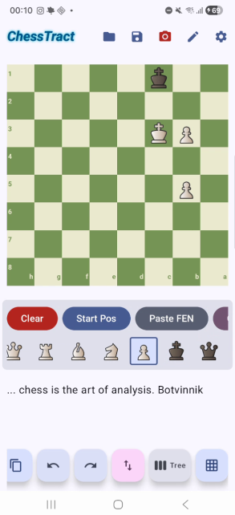
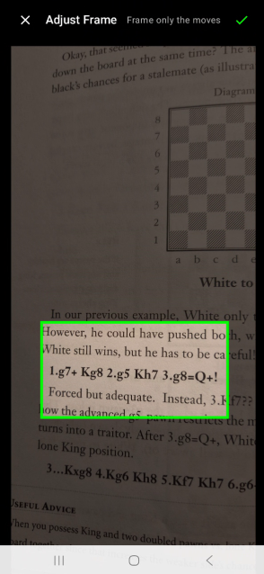
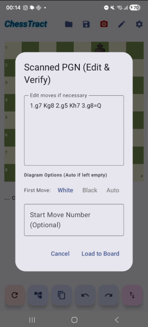
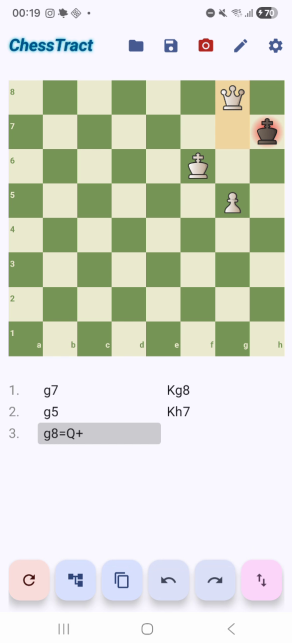
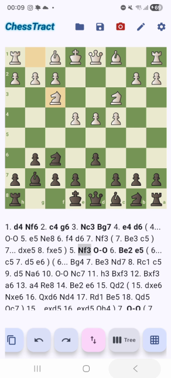
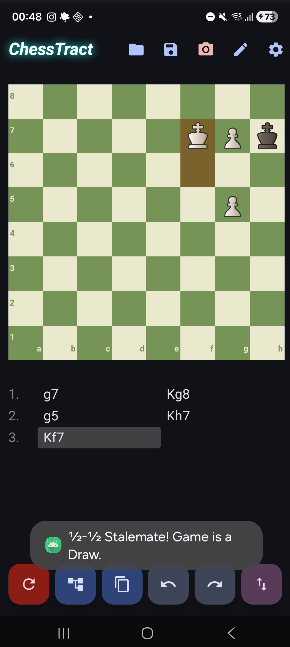

# ♟️ ChessTract: The Ultimate Chess Analysis & PGN Extraction Tool

  

**ChessTract** was born out of a real, unfulfilled need in the chess app ecosystem. Existing tools were either purely engine-focused, designed only for online play, or too cumbersome for immediate post-game human analysis. I needed a tool to perform pure, "Botvinnik-style" analysis right after a tournament game while the memory is fresh—without engine interference—and instantly extract the PGN to share with club mates, build a personal database, or analyze further on Lichess/Chess.com. 

What started as a fast PGN extraction tool has evolved into a comprehensive, Android-based chess study laboratory bridging the gap between physical chess books and digital analysis.

  

## ✨ The Origin & Core Philosophy
* **Botvinnik-Style Post-Game Analysis:** Input your moves manually right after a game. Focus on human calculation and variation building without the immediate distraction of engine evaluations.
* **Instant PGN Extraction & Sharing:** Generate accurate PGNs (and FENs) instantly. Copy your entire analysis tree to your clipboard to share with your coach, club mates, or paste into online platforms.
* **Building a Personal Archive:** A robust local Room database allows you to archive your own games, theoretical opening studies, and tournament memories with full metadata.

## 🚀 Key Features

* 📸 **AI-Powered OCR (Book-to-Board):** Take a photo of any chess notation from a physical book. ChessTract intelligently scans, crops, localizes (supports English, German, and Turkish notations), and perfectly recreates the game tree on your screen.
* 🌳 **Advanced Tree & Variation UI:** Seamlessly explore complex opening theories or deep endgame variations with a robust, clickable, and highlighted PGN tree notation.
* 🧩 **Board Setup & Diagram Mode:** Manually place pieces on the board to study specific endgame puzzles, verify OCR outputs, and extract instant FEN strings.
* 🕰️ **Interactive Time Travel:** Jump effortlessly between moves and variations. The custom engine handles absolute pins, en passant, promotion traps, and castling rules dynamically with realistic sound cues.
* 🎨 **Customizable Experience:** Switch between light/dark board themes and choose your preferred audio cues (including intense 'Karate' sound effects or standard 'Lichess' audio).
* 🌓 **Dynamic UI:** A fully responsive Jetpack Compose interface that adapts beautifully to both system Dark and Light themes with dynamic neon typography.

## 🗺️ Roadmap & Future Plans

The development of ChessTract is an ongoing journey. The following features are currently in the pipeline to make it an even more powerful study tool:

* **🔍 Advanced Archive Filtering & Search:** As local databases grow, finding specific studies becomes crucial. We are building smart filtering mechanisms to search saved games by specific openings (e.g., `1.e4` vs `1.d4`), total move counts, and match results (Win/Draw/Loss).
* **🖼️ Diagram OCR Verification:** Expanding our image processing capabilities to allow users to snap a photo of a physical chess board diagram and instantly extract the exact position (FEN), bypassing manual setup entirely.
* **☁️ Optional Cloud Sync & Microservices:** Developing a dedicated backend to allow users to backup their archives off-device. **Privacy first:** The app will always function as a 100% local, offline tool by default. Cloud synchronization and social interactions will be strictly opt-in features for those who want connectivity.

## 📱 Application Flow & Interface

### 1. Board Setup & Smart Cropping
Before parsing the book, you can arrange specific endgame positions. When taking a picture, our custom Canvas overlay lets you crop exact text blocks.
| Board Setup Palette | Full-Screen Image Cropper |
| :---: | :---: |
|  |  |

### 2. Verify & Import
The AI text recognition extracts raw moves. You can inspect the text, override the starting move number or color, and load it directly.
| Edit, Verify & Adjust Options | Analysis Loaded to Board |
| :---: | :---: |
|  |  |

### 3. Deep Analysis & Game Rules
Navigate variations seamlessly. The tree dynamically highlights your current timeline, while the rule engine enforces complex checkmates and stalemates.
| TreeView Live Highlight | Stalemate Event & Audio Trigger |
| :---: | :---: |
|  |  |

## 🛠️ Tech Stack & Architecture

* **UI Framework:** Jetpack Compose (100% Kotlin)
* **Architecture:** MVVM (Model-View-ViewModel) with StateFlow
* **Database:** Room (Local SQLite)
* **Image Processing:** Google ML Kit Text Recognition, Custom Compose Canvas Cropper
* **Game Logic:** Custom-built Chess Engine validating legal moves, checkmate, and stalemate.

## 👨‍💻 About the Developer

Developed by an active tournament player and App & Web Developer with a passion for clean code architecture. Due to the proprietary nature of the custom OCR-to-PGN algorithmic parsers, this repository serves as a showcase. Bug reports, feature requests, and discussions are always welcome!
